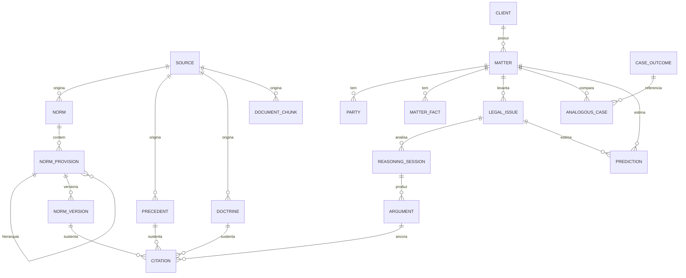

# Modelo de Dados — dicionário, diagrama ER e padrões de consulta

Companion do [`../data/schema.sql`](../data/schema.sql). Cinco camadas: **Conhecimento → Casos → Raciocínio → Jurimetria → Governança**.

---

## 1. Diagrama ER (visão lógica)



---

## 2. Dicionário (resumo por camada)

**Conhecimento** — `source` (fonte canônica + viés/independência), `norm`/`norm_provision`/`norm_version` (norma → dispositivo → redação temporal), `precedent` (jurisprudência), `doctrine`, `document_chunk` (índice RAG unificado).

**Casos** — `client`, `matter` (caso), `party` (partes), `matter_fact` (fatos, com `proven`), `legal_issue` (a pergunta real, `dimension` mérito/forma).

**Raciocínio** — `reasoning_session` (uma execução do método), `argument` (tese/antítese/síntese + `strength`), `citation` (liga argumento → fonte, com `verification`).

**Jurimetria** — `case_outcome` (histórico de desfechos), `analogous_case` (vizinhança vetorial), `prediction` (`success_prob` + `confidence` + `sample_size`).

**Governança** — `audit_log` (toda ação rastreada), `current_provision` (view: redação vigente).

---

## 3. Padrões de consulta

### 3.1 RAG — recuperação híbrida (vetorial + lexical)

```sql
-- Busca os trechos mais relevantes para a questão, combinando similaridade
-- semântica (embedding) com casamento lexical de termos jurídicos exatos.
WITH q AS (SELECT $1::vector AS emb, $2::text AS termo)
SELECT c.id, c.content, s.title, s.official, s.bias_note,
       1 - (c.embedding <=> q.emb) AS sim_semantica,
       similarity(c.content, q.termo) AS sim_lexical
FROM legal.document_chunk c
JOIN q ON true
LEFT JOIN legal.source s ON s.id = c.source_id
ORDER BY (1 - (c.embedding <=> q.emb)) * 0.7
       + similarity(c.content, q.termo) * 0.3 DESC
LIMIT 12;
```

### 3.2 Redação literal vigente de um dispositivo (com status de verificação)

```sql
SELECT short_name, citation_key, full_text, amended_by, verification
FROM legal.current_provision
WHERE citation_key = 'art. 5º, LV, CF';
-- Só tratar full_text como autêntico se verification = 'verificada'.
```

### 3.3 Probabilidade de êxito a partir de casos análogos

```sql
-- Vizinhança vetorial do caso atual sobre o histórico de desfechos,
-- agregando taxa de procedência ponderada pela similaridade.
WITH viz AS (
  SELECT o.outcome,
         1 - (o.embedding <=> m.embedding) AS sim
  FROM legal.case_outcome o
  CROSS JOIN (SELECT embedding FROM legal.matter WHERE id = $1) m
  WHERE o.practice_area = $2
  ORDER BY o.embedding <=> m.embedding
  LIMIT 200
)
SELECT
  count(*)                                         AS amostra,
  round(avg(sim)::numeric, 3)                       AS similaridade_media,
  -- distância de cosseno (<=>) retorna double precision; round() exige numeric:
  round((sum(CASE WHEN outcome IN ('procedente','parcialmente_procedente')
                  THEN sim ELSE 0 END) / nullif(sum(sim),0))::numeric, 3) AS prob_exito_ponderada
FROM viz;
-- Resultado alimenta legal.prediction (success_prob, sample_size=amostra).
```

### 3.4 Mapa de tese — argumentos e suas fontes verificáveis

```sql
SELECT a.role, a.statement, a.strength,
       cit.pinpoint, cit.supports, cit.verification
FROM legal.reasoning_session rs
JOIN legal.argument a   ON a.session_id = rs.id
LEFT JOIN legal.citation cit ON cit.argument_id = a.id
WHERE rs.issue_id = $1
ORDER BY a.role, a.strength DESC;
```

---

## 4. Decisões de projeto (e por quê)

- **Versionamento temporal da norma** (`norm_version.valid_from/valid_to`): a Constituição muda por ECs; precisamos responder "o que vale hoje" e "o que valia na data do fato".
- **Citação polimórfica com `CHECK (num_nonnulls(...) = 1)`**: cada citação aponta para exatamente uma fonte (norma, precedente ou doutrina) — sem ambiguidade.
- **`verification_status` em tudo que é citável**: operacionaliza "fontes verificáveis, nunca invenção".
- **`source.independence` + `bias_note`**: a parcialidade fica registrada na fonte, sem contaminar o juízo de mérito.
- **HNSW + pg_trgm**: termos jurídicos exigem casamento exato ("repercussão geral", nº de tema) que a busca puramente semântica perde.
- **`prediction` com `confidence` e `sample_size`**: probabilidade honesta, nunca veredito.

---

*Estrutura para fins de produto/raciocínio jurídico; não substitui parecer de profissional habilitado nem decisão judicial.*
